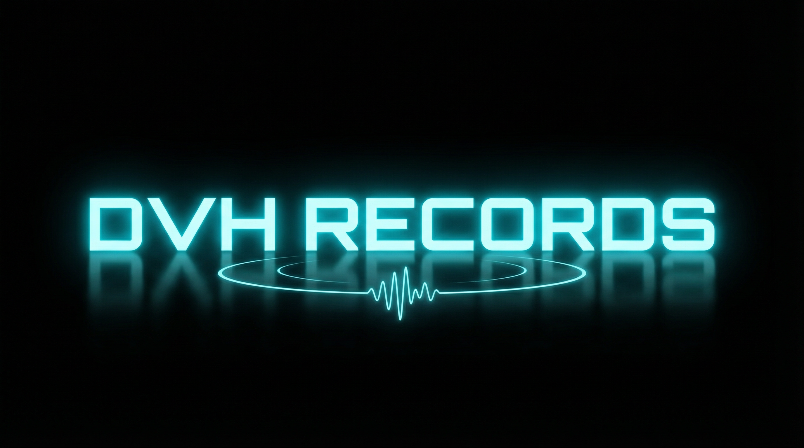

# 🎵 DVH Records - Gravadora Digital Interativa

Site oficial da DVH Records, uma gravadora digital especializada em Drum & Bass, House, Bass Music e Electropop.



---

## ✨ Funcionalidades

### 🎨 Interface Interativa
- **Hero Section** fullscreen com logo animado e glow effects ciano neon
- **Caixa de Discos** com carrossel vertical de capas
- **Toca-discos 3D realista** inspirado em Technics com drag & drop
- **Player de áudio** com visualizador de waveform em tempo real (estilo Traktor/Serato)
- **Perfil de artista** com bio, tracks e links sociais

### 🎵 Roster de Artistas
9 artistas únicos com diferentes gêneros:
- Digital Hunters (Drum & Bass)
- Eddie Hunter (Deep House)
- AION (Bass Music / Dubstep)
- JFX (Jungle / Drum & Bass)
- C.A.B.L.E. (Pagode Eletrônico / Axé Bass)
- Daniel Maia (Tech House)
- Samuel Smithson (Electropop)
- Crystal Wash (Progressive House)
- Digital Queens (Bass House)

### 🔐 Admin Panel
- Autenticação Firebase
- CRUD completo de artistas
- Upload de imagens (capas + logos)
- Upload de músicas (MP3/WAV)
- Gerenciamento de tracks
- Integração com Spotify/SoundCloud/Apple Music

### 🛡️ Segurança
- Clique direito desabilitado
- Download de áudio/imagens bloqueado
- Atalhos de teclado protegidos
- Headers de segurança configurados

---

## 🛠️ Tecnologias

### Frontend
- **React 19** - Framework UI
- **Vite** - Build tool
- **TypeScript** - Type safety
- **Tailwind CSS 4** - Styling
- **Framer Motion** - Animações
- **WaveSurfer.js** - Visualizador de waveform

### Backend
- **Express 4** - Server framework
- **tRPC 11** - Type-safe API
- **Drizzle ORM** - Database ORM
- **TiDB** - Banco de dados MySQL-compatible
- **Manus OAuth** - Autenticação integrada

### Storage & Deploy
- **Amazon S3** - Armazenamento de arquivos (pré-configurado)
- **Manus Hosting** - Hosting integrado com custom domains
- **GitHub** - Controle de versão

---

## 📦 Estrutura do Projeto

```
dvh-records/
├── client/                    # Código do frontend
│   ├── public/               # Assets estáticos
│   │   └── images/           # Imagens (capas, logos, toca-discos)
│   ├── src/
│   │   ├── components/       # Componentes React
│   │   ├── pages/            # Páginas (Home, Admin)
│   │   ├── hooks/            # Custom hooks
│   │   ├── lib/              # Configurações (Firebase, helpers)
│   │   ├── data/             # Dados mockados
│   │   └── index.css         # Estilos globais
│   └── index.html
├── netlify.toml              # Configuração Netlify
├── .env.example              # Template de variáveis de ambiente
├── FIREBASE_SETUP.md         # Instruções Firebase
├── DEPLOY_NETLIFY.md         # Guia de deploy
└── README.md                 # Este arquivo
```

---

## 🚀 Instalação Local

### Pré-requisitos
- Node.js 22.x
- pnpm (gerenciador de pacotes)
- Conta Firebase configurada

### Passos

1. **Clone o repositório**
```bash
git clone https://github.com/eduardoabreu81/dvhrecords.git
cd dvhrecords
```

2. **Instale as dependências**
```bash
cd client
pnpm install
```

3. **Configure as variáveis de ambiente**
```bash
# Copie o arquivo de exemplo
cp .env.example .env

# Edite o .env e adicione suas credenciais Firebase
# (veja FIREBASE_SETUP.md para instruções detalhadas)
```

4. **Inicie o servidor de desenvolvimento**
```bash
pnpm dev
```

5. **Acesse o site**
```
http://localhost:5173
```

---

## 🔐 Autenticação

Este projeto usa **Manus OAuth** integrado (não Firebase). A autenticação é gerenciada automaticamente via cookies de sessão.

- Login: `getLoginUrl()` redireciona para portal OAuth
- Logout: `trpc.auth.logout.useMutation()`
- Estado do usuário: `trpc.auth.me.useQuery()`

---

## 🌐 Deploy

O projeto usa **Manus Hosting** integrado:

1. Criar checkpoint via Manus UI
2. Clicar em "Publish" na interface
3. Configurar custom domain nas Settings

**Nota**: Este projeto usa Express + tRPC no backend, portanto requer ambiente Node.js. Não é compatível com Netlify/Vercel static hosting sem adaptações.

---

## 🎨 Design

### Paleta de Cores
- **Preto Absoluto**: `#000000`
- **Ciano Neon**: `#00F0FF`
- **Branco**: `#FFFFFF`

### Tipografia
- **Títulos**: Orbitron (Google Fonts)
- **Corpo**: Exo 2 (Google Fonts)

### Estilo Visual
- Futurismo Dark Interativo
- Glow effects em elementos ciano
- Animações suaves com Framer Motion
- Grid animado no background

---

## 📱 Responsividade

O site é totalmente responsivo e funciona em:
- 💻 Desktop (1920x1080+)
- 💻 Laptop (1366x768+)
- 📱 Tablet (768x1024)
- 📱 Mobile (375x667+)

---

## 🔐 Admin Panel

Acesse o painel administrativo em: `/admin`

**Funcionalidades:**
- Login com Manus OAuth
- Visualizar todos os artistas
- Adicionar novos artistas (em desenvolvimento)
- Editar artistas existentes (em desenvolvimento)
- Deletar artistas
- Upload de imagens e músicas para S3 (em desenvolvimento)

---

## 📄 Licença

© 2026 DVH Records. Todos os direitos reservados.

---

## 👨‍💻 Desenvolvido por

**LocalBiz Academy**  
https://localbizacademy.com

---

## 📞 Contato

- **Website**: https://dvhrecords.com
- **Instagram**: @dvhrecords
- **SoundCloud**: /dvhrecords
- **Email**: contact@dvhrecords.com

---

## 🙏 Agradecimentos

- Technics pela inspiração do toca-discos
- Traktor/Serato pelo design do waveform visualizer
- Comunidade open-source pelas bibliotecas utilizadas

---

**Global sounds. Bass driven.** 🎵
